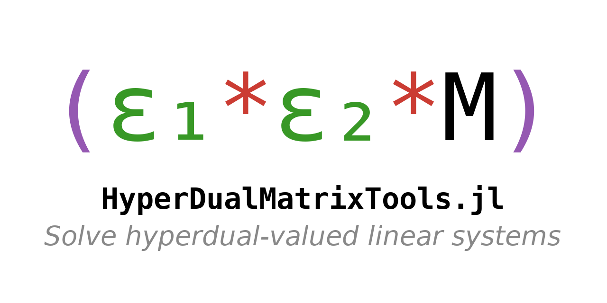

[HyperDualMatrixTools](https://github.com/briochemc/HyperDualMatrixTools.jl) provides an overloaded `factorize` and `\` that work with hyperdual-valued arrays.

It uses the hyper dual type defined by the [HyperDualNumbers.jl](https://github.com/JuliaDiff/HyperDualNumbers.jl) package.
The idea is that for a hyperdual-valued matrix

$$M = A + \varepsilon_1 B + \varepsilon_2 C + \varepsilon_1\varepsilon_2 D,$$

its inverse is given by

$$M^{-1} = (I - \varepsilon_1 A^{-1} B - \varepsilon_2 A^{-1} C - \varepsilon_1\varepsilon_1 A^{-1} (D - C A^{-1} B - B A^{-1} C)) A^{-1}.$$

Therefore, only the inverse of $A$ is required to evaluate the inverse of $M$.
This package makes available a `HyperDualFactors` type which containts the factors of $A$ and the non-real parts of $M$, and overloads `factorize` to create an instance of `HyperDualFactors`, which can then be called with `\` to efficiently solve hyperdual-valued linear systems of the type $M x = b$.

This package should be useful for autodifferentiation of functions that use `\`.
Note that this package is the equivalent of the [DualMatrixTools.jl](https://github.com/briochemc/DualMatrixTools.jl) package, but for hyperdual numbers instead of dual numbers.

## Usage

- Create your hyperdual-valued matrix `M`:

```julia
julia> M = A + ε₁ * B + ε₂ * C + ε₁ε₂ * D
```

- Factorize `M`:

```julia
julia> Mf = factorize(M)
```

- Apply `\` to solve systems of the type `M * x = b`

```julia
julia> x = Mf \ b
```

## Advanced usage

In the context of iterative processes with multiple factorizations and forward and back substitutions, you may want to propagate hyperdual-valued numbers while leveraging (potentially) the fact the real part of the matrices to be factorized remains the same throughout.
This package provides an in-place `factorize`, with a flag to update (or not) the factors.
Usage is straightforward.
By default, `factorize` does *not* update the factors

```julia
julia> factorize(Mf, M) # only Mf.B, Mf.C, and Mf.D is updated
```

If you want to update the real-valued factors too, use

```julia
julia> factorize(Mf, M, update_factors=true) # The factors in Mf.Af are also updated
```

## Citation

If you use this package, please cite it!
Use the button at the top of this page, or go to the [Zenodo record of the package](https://doi.org/10.5281/zenodo.1734670) and export the citation from there (the "Export" box at the bottom of that page).


